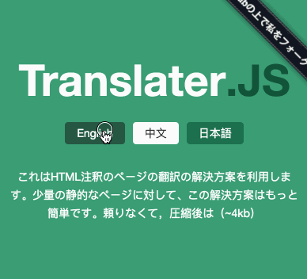

<div markdown="1">
  <sup>使用 <a href="https://wangchujiang.com/#/app" target="_blank">我的应用</a> 也是一种 <a href="https://wangchujiang.com/#/sponsor" target="_blank">支持</a> 我的方式：</sup>
  <br>
  <a target="_blank" href="https://apps.apple.com/app/6758053530" title="Scap: Screenshot & Markup Edit for macOS"></a>
  <a target="_blank" href="https://apps.apple.com/app/6757317079" title="Screen Test for macOS"></a>
  <a target="_blank" href="https://apps.apple.com/app/Deskmark/6755948110" title="Deskmark for macOS"></a>
  <a target="_blank" href="https://apps.apple.com/app/Keyzer/6500434773" title="Keyzer for macOS"></a>
  <a target="_blank" href="https://github.com/jaywcjlove/vidwall-hub" title="Vidwall Hub for macOS"></a>
  <a target="_blank" href="https://apps.apple.com/app/VidCrop/6752624705" title="VidCrop for macOS"></a>
  <a target="_blank" href="https://apps.apple.com/app/Vidwall/6747587746" title="Vidwall for macOS"></a>
  <a target="_blank" href="https://wangchujiang.com/mousio-hint/" title="Mousio Hint for macOS"></a>
  <a target="_blank" href="https://apps.apple.com/app/6746747327" title="Mousio for macOS"></a>
  <a target="_blank" href="https://apps.apple.com/app/6745227444" title="Musicer for macOS"></a>
  <a target="_blank" href="https://apps.apple.com/app/6743841447" title="Audioer for macOS"></a>
  <a target="_blank" href="https://apps.apple.com/app/6744690194" title="FileSentinel for macOS"></a>
  <a target="_blank" href="https://apps.apple.com/app/6743495172" title="FocusCursor for macOS"></a>
  <a target="_blank" href="https://apps.apple.com/app/6742680573" title="Videoer for macOS"></a>
  <a target="_blank" href="https://apps.apple.com/app/6740425504" title="KeyClicker for macOS"></a>
  <a target="_blank" href="https://apps.apple.com/app/6739052447" title="DayBar for macOS"></a>
  <a target="_blank" href="https://apps.apple.com/app/6739444407" title="Iconed for macOS"></a>
  <a target="_blank" href="https://apps.apple.com/app/6737160756" title="Menuist for macOS"></a>
  <a target="_blank" href="https://apps.apple.com/app/6723903021" title="Paste Quick for macOS"></a>
  <a target="_blank" href="https://apps.apple.com/app/6670696072?platform=mac" title="Quick RSS for macOS/iOS"></a>
  <a target="_blank" href="https://apps.apple.com/app/6670167443" title="Web Serve for macOS"></a>
  <a target="_blank" href="https://apps.apple.com/app/6503953628?platform=mac" title="Copybook Generator for macOS/iOS"></a>
  <a target="_blank" href="https://apps.apple.com/app/6471227008?platform=mac" title="DevTutor for macOS/iOS"></a>
  <a target="_blank" href="https://apps.apple.com/app/6479819388?platform=mac" title="RegexMate for macOS/iOS"></a>
  <a target="_blank" href="https://apps.apple.com/app/6479194014?platform=mac" title="Time Passage for macOS/iOS"></a>
  <a target="_blank" href="https://apps.apple.com/app/6478772538" title="IconizeFolder for macOS"></a>
  <a target="_blank" href="https://apps.apple.com/app/6478511402?platform=mac" title="Textsound Saver for macOS/iOS"></a>
  <a target="_blank" href="https://apps.apple.com/app/6476924627" title="Create Custom Symbols for macOS"></a>
  <a target="_blank" href="https://apps.apple.com/app/6476452351" title="DevHub for macOS"></a>
  <a target="_blank" href="https://apps.apple.com/app/6476400184" title="Resume Revise for macOS"></a>
  <a target="_blank" href="https://apps.apple.com/app/6472593276" title="Palette Genius for macOS"></a>
  <a target="_blank" href="https://apps.apple.com/app/6470879005" title="Symbol Scribe for macOS"></a>
</div>
<hr>

# translater.js

[](https://jaywcjlove.github.io/#/sponsor) 
[](https://x.com/jaywcjlove) 
[](https://www.npmjs.com/package/translater.js) 
[](#) 
[](https://jaywcjlove.github.io/translater.js/?lang=cn) 
[](https://jaywcjlove.github.io/translater.js/?lang=en) 
[](https://cdnjs.com/libraries/translater.js)

这是一个利用HTML注释的页面翻译解决方案。对于少量的静态页面，这种解决方案显得更简单。它没有依赖，压缩只有只有(~2kb)。官方文档 [实例预览](http://jaywcjlove.github.io/translater.js/).

- 支持 `IMG` `文本` 切换
- 支持 URL 加载语言
- 支持本地缓存选择



## 安装

```bash
$ npm install translater.js
```

```
import 'translater.js';
```

或者手动下载并在HTML中链接 **[translater.js](https://unpkg.com/translater.js/dist/)**，也可以通过 [UNPKG](https://unpkg.com/translater.js/dist/) 下载：

```html
<div>
  这里是中文
  <!--{jp}ここは日本語です-->
  <!--{en}Here is English-->
</div>
<script src="https://unpkg.com/translater.js/dist/translater.js" type="text/javascript"></script>
<script type="text/javascript">
var tran = new Translater({
  lang:"jp"
});
</script>
```

切换语言方法通过超链接

```html
<a href="javascript:tran.setLang('default');">English</a>
<a href="javascript:tran.setLang('jp');">日本語</a>
<a href="javascript:tran.setLang('cn');">中文</a>
```

可以通过URL穿参数设置语言

```url
http://127.0.0.1:9005/test/test.html?lang=jp
```

## Text

```html
<div>
  这里是中文
  <!--{jp}ここは日本語です-->
  <!--{en}Here is English-->
</div>
```

## Image

```html

```

## Input

```html
<input type="text" placeholder="like this?"  placeholder-cn="像这样？"  />
<input type="button" value="button" value-cn="按钮" value-jp="按钮日本"  />
```

## getLang/setLang

获取或设置当前语言。

```html
<script type="text/javascript">
  var tran = new Translater();
  if (tran.getLang() === "default") tran.setLang('en');
</script>
```

