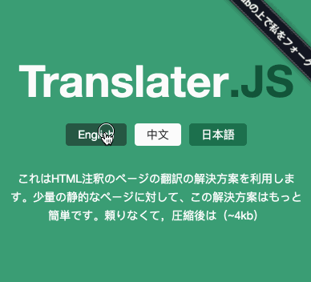

# translater.js

[](https://www.npmjs.com/package/translater.js) [](#) [](#) [](#) [](https://jaywcjlove.github.io/translater.js/?lang=cn) [](https://jaywcjlove.github.io/translater.js/?lang=en) [](https://cdnjs.com/libraries/translater.js)

这是一个利用HTML注释的页面翻译解决方案。对于少量的静态页面，这种解决方案显得更简单。它没有依赖，压缩只有只有(~2kb)。

- 支持 `IMG` `文本` 切换
- 支持 URL 加载语言
- 支持本地缓存选择



# 作为模块安装

```bash
$ npm install translater.js
```

# 传统使用方法

```html
<div>
    这里是中文
    <!--{jp}ここは日本語です-->
    <!--{en}Here is English-->
</div>
<script src="../dist/translater.min.js" type="text/javascript"></script>
<script type="text/javascript">
var tran = new Translater({
    lang:"jp"
});
</script>
```

切换语言方法通过超链接

```html
<a href="javascript:tran.setLang('default');">English</a>
<a href="javascript:tran.setLang('jp');">日本語</a>
<a href="javascript:tran.setLang('cn');">中文</a>
```

可以通过URL穿参数设置语言

```url
http://127.0.0.1:9005/test/test.html?lang=jp
```

## Text

```html
<div>
    这里是中文
    <!--{jp}ここは日本語です-->
    <!--{en}Here is English-->
</div>
```

## Image

```html

```

## Input

```html
<input type="text" placeholder="like this?"  placeholder-cn="像这样？"  />
<input type="button" value="button" value-cn="按钮" value-jp="按钮日本"  />
```

## getLang/setLang

获取或设置当前语言。

```html
<script type="text/javascript">
    var tran = new Translater();
    if (tran.getLang() === "default") tran.setLang('en');
</script>
```

